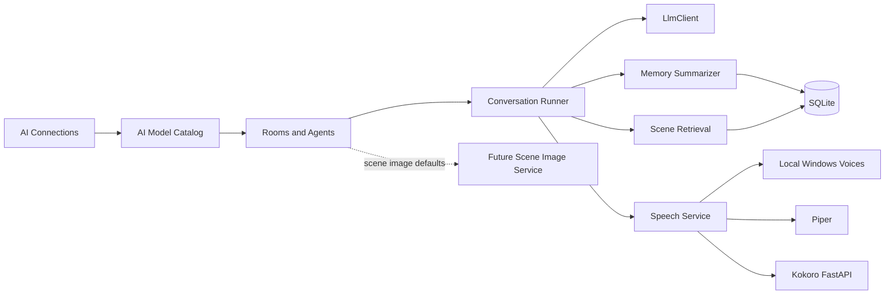

# Agent Group Chat

[](hybrid/src/AgentGroupChat.Hybrid/AgentGroupChat.Hybrid.csproj)
[](hybrid/src/AgentGroupChat.Hybrid/AgentGroupChat.Hybrid.csproj)
[](hybrid/src/AgentGroupChat.Infrastructure/Data/AppDbContext.cs)
[](hybrid/src/AgentGroupChat.Core/Services/LlmClient.cs)
[](hybrid/src/AgentGroupChat.Core/Services/SpeechService.cs)
[](hybrid/src/AgentGroupChat.Hybrid)

> A Windows-first multi-agent conversation studio for themed rooms, persistent memory, narrated dialogue, scene archives, and future-ready manual scene image generation.

Agent Group Chat lets you wire together multiple AI providers, assign distinct prompts and voices to agents, and run turn-based group conversations inside reusable rooms. It is designed for creative collaboration, roleplay, simulated interviews, writer's rooms, and game-master-style scenarios where persistent memory and pacing matter.

## What this project is

- The active app is the .NET 10 MAUI Blazor Hybrid client in `hybrid/src/AgentGroupChat.Hybrid`.
- The older WPF app still lives at the repo root and remains useful as a migration/reference surface.
- The current hybrid build already supports layered memory, scene archive retrieval, multi-provider text models, logs, and speech playback.
- Scene image generation is being built as a manual, local-first feature. The room-side foundations are already present, but the provider catalog and one-click generate flow are still in progress.

## Why it is useful

- Run several distinct AI personas in the same room, with different prompts, models, colors, and voices.
- Keep conversations coherent with shared room memory, durable world memory, and per-agent private memory.
- Let a privileged DM or coordinator spawn, suspend, and dismiss temporary NPC agents.
- Replay or narrate conversations out loud with local Windows voices, Piper, or Kokoro.
- Archive meaningful scenes and retrieve them later when the conversation needs long-range continuity.

## Good room ideas

- A DnD table where one agent is the DM, two are players, and the user jumps in between rounds.
- A creative studio where one agent is optimistic, one is skeptical, and one is a calm editor.
- An interview simulator with a recruiter, hiring manager, and candidate coach.
- A story room where agents debate plot direction, pacing, and tone.

## Current status

| Area | Status |
| --- | --- |
| Hybrid app | Active and usable |
| Legacy WPF app | Retained for reference/migration |
| LLM model catalog | Implemented |
| Memory + scene retrieval | Implemented |
| Logs + memory inspector | Implemented |
| TTS playback | Implemented |
| STT / microphone capture | Not implemented yet |
| Manual scene image generation | Foundations landed, generation workflow still in progress |

## Architecture at a glance



## Repository map

| Path | Purpose |
| --- | --- |
| `hybrid/src/AgentGroupChat.Hybrid` | Active Windows MAUI Blazor Hybrid UI |
| `hybrid/src/AgentGroupChat.Core` | Domain models and orchestration services |
| `hybrid/src/AgentGroupChat.Infrastructure` | EF Core, SQLite, repositories, migration |
| `Kokoro-FastAPI` | Local Kokoro speech server checkout / integration helper |
| `LocalRuntimeSetupDiscovery.md` | Notes about Piper, Kokoro, and Ollama setup strategy |
| `hybrid/src/SCENE-IMAGE-GENERATION.md` | Manual scene image generation design plan |
| `AgentGroupChat.csproj` | Older WPF app kept in the repo root |

## Requirements

### Required

- Windows 10/11
- .NET 10 SDK
- At least one usable LLM backend
  - API-based: Groq, Gemini, Hugging Face, OpenAI-compatible providers, OpenRouter, etc.
  - Local: Ollama

### Optional but recommended

- Python 3.13 for Kokoro or ComfyUI setup
- `uv` for Kokoro-FastAPI startup scripts
- eSpeak NG for Kokoro phonemizer support on Windows
- ComfyUI if you want to prepare for local image generation

## Quick start

### 1. Run the hybrid app

```powershell
dotnet restore .\hybrid\src\AgentGroupChat.Hybrid\AgentGroupChat.Hybrid.csproj
dotnet run --project .\hybrid\src\AgentGroupChat.Hybrid\AgentGroupChat.Hybrid.csproj
```

The hybrid app targets `net10.0-windows10.0.19041.0` and launches as a regular Windows executable, not an MSIX package.

### 2. Let it create local storage

On first launch, the app creates a SQLite database here:

```text
%LOCALAPPDATA%\AgentGroupChat\agentgroupchat.db
```

If legacy JSON/TXT settings exist from the older app, the hybrid app migrates them into SQLite on startup.

### 3. Follow the in-app setup order

The built-in Setup Guide already points users in the right order:

1. Decide whether to configure TTS now or skip it.
2. Open `AI Models` and add at least one connection plus one model.
3. Open `Rooms` and create a room with one or more agents.
4. Open `Chat`, load the room, type a prompt, and run a round.
5. Open `Logs` to inspect requests, memory, timings, and archived scenes.

## The app flow

### AI Models

The app separates `connections` from `models`.

- A connection is the transport and credentials layer.
- A model is a catalog entry that points at one connection plus a provider model id.

That makes it easy to keep multiple logical models around, even if they point to the same provider.

Supported transport shapes today:

| Transport | Typical use |
| --- | --- |
| OpenAI-compatible | OpenRouter, vLLM, LM Studio, custom gateways |
| Groq | Fast hosted inference |
| Gemini | Google-hosted models |
| Hugging Face | Hosted inference endpoints |
| Ollama | Local local-model workflows |

### Rooms

Each room controls the conversation environment.

Room settings currently include:

- topic and name
- pacing and pause behavior
- transcript window size
- summarizer model and summarization profile
- scene archive enablement and cap
- privileged-action / NPC controls
- scene-image style notes and negative prompt defaults

Each agent can currently carry:

- a model selection
- a system prompt
- enabled/disabled state
- token override and compaction budget
- chat colors
- a TTS voice override
- an `AppearanceSummary` for future scene-image prompt drafting

### Chat

The Chat page is where everything comes together:

- load a room
- send a user message
- run one or more rounds
- stop a run
- narrate the transcript
- continue speaking from a chosen message with `Play from here`

### Logs

The Logs page is not just a log sink. It also acts as a memory inspection surface.

You can inspect:

- shared room memory
- durable memory
- agent short memory
- agent long memory
- scene archives
- category-filtered logs for system, timing, request, response, and memory activity

## Memory model

The current hybrid build uses four structured memory layers:

| Memory kind | Purpose |
| --- | --- |
| `SharedRoom` | Current scene state and active shared context |
| `Durable` | Sticky world facts and long-running state |
| `AgentShort` | One-turn private scratchpad per agent |
| `AgentLong` | Longer-lived private notes per agent |

The runner updates memory after rounds, stores archives of meaningful scenes, and can retrieve past scenes back into prompt context when scene archive is enabled.

## Privileged DM and NPC support

Rooms can designate one permanent agent as the privileged actor.

That privileged agent can be configured to:

- spawn temporary NPC agents
- suspend agents temporarily
- dismiss NPCs at round boundaries

This makes the app useful for GM-style roleplay rooms, moderator-driven simulations, or any setup where one agent needs limited orchestration authority over the cast.

## Text-to-speech

The app currently supports three speech backends:

| Provider | Setup effort | Notes |
| --- | --- | --- |
| `Local` | Lowest | Uses Windows-installed local voices |
| `Piper` | Medium | Offline and lightweight, but current hybrid path setup is still more manual |
| `Kokoro` | Medium-high | Best narrative quality in this repo today, recommended for most users |

### Local Windows voices

If you just want to hear the room speak without setting up anything external:

1. Run the app.
2. Open `Chat`.
3. Turn `Speech` on.
4. Set provider to `Local`.

This is the fastest way to validate the speech gate and room pacing.

### Kokoro setup on Windows (recommended)

Kokoro gives the best narrative result in this repo right now. The bundled integration expects an OpenAI-compatible speech endpoint on port `8880`.

#### Prerequisites

1. Install Python 3.13.
2. Install `uv`.
3. Install eSpeak NG.

If this command fails:

```powershell
py -3.13 --version
```

check installed versions with:

```powershell
py -0p
```

If only `3.14` or another version is listed, install Python 3.13 before continuing.

#### Start Kokoro from this repo

```powershell
cd .\Kokoro-FastAPI
.\start-cpu.ps1
```

What the script does on first run:

- sets the eSpeak DLL environment variable
- installs the Kokoro package and CPU dependencies through `uv`
- downloads the Kokoro model
- starts the FastAPI server on `http://127.0.0.1:8880`

Useful endpoints once it is running:

- API base: `http://127.0.0.1:8880`
- OpenAI-compatible speech API: `http://127.0.0.1:8880/v1/audio/speech`
- Voices: `http://127.0.0.1:8880/v1/audio/voices`
- Swagger docs: `http://127.0.0.1:8880/docs`

#### Enable Kokoro inside Agent Group Chat

1. Open `Chat`.
2. Turn `Speech` on.
3. Choose `Kokoro` as provider.
4. Click `Test Kokoro`.
5. Click `Refresh Voices`.
6. Choose a default agent voice and optional user voice.

The app also has a `Start Service` helper button on the Chat page. It tries to launch `start-cpu.ps1` if the script is available in a known local path.

#### If your checkout does not include `Kokoro-FastAPI`

Clone the upstream project into that folder or run an existing Kokoro service elsewhere and point the app at it once a dedicated base-URL settings surface lands.

### Piper setup on Windows (supported, but more manual today)

Piper support exists in the speech service and works well as a simpler offline backup, but the current hybrid UI does not yet expose a polished path-picker flow for `PiperExePath` and `PiperModelsDir`.

Recommended local layout:

```text
%LOCALAPPDATA%\AgentGroupChat\piper\piper.exe
%LOCALAPPDATA%\AgentGroupChat\piper\models\en_US-amy-medium.onnx
%LOCALAPPDATA%\AgentGroupChat\piper\models\en_US-amy-medium.onnx.json
```

Piper model expectations in the current code:

- the models directory must exist
- the selected voice can be either the filename stem or the full `.onnx` filename
- if no voice is specified, the first `.onnx` model found in the folder is used
- the matching `.json` file is used to detect sample rate

<details>
<summary>Advanced note: manual Piper configuration in the current hybrid build</summary>

Today, the hybrid app exposes the provider switch but not yet a dedicated UI for Piper path settings. That means Piper is still best treated as a developer or advanced-user setup.

At a minimum you need to populate these app settings fields locally:

- `PiperExePath`
- `PiperModelsDir`

Those settings live in the local SQLite app database at `%LOCALAPPDATA%\AgentGroupChat\agentgroupchat.db`.

Per-agent `TtsVoice` values should match the model filename stem or `.onnx` filename, for example:

- `en_US-amy-medium`
- `en_US-amy-medium.onnx`

If you want the smoothest experience in the current hybrid app, Kokoro is the better-supported choice.

</details>

## Image generation

The image feature is intentionally being built in a conservative way.

### Current direction

- manual generation only for MVP
- local-first provider support
- ComfyUI as the first backend target
- room-level scene image toggle plus style notes and negative prompt defaults
- per-agent `AppearanceSummary` fields for reusable visual descriptions

### Current implementation status

Already in the app:

- `Enable Scene Image Generation` room toggle
- room-level style notes
- room-level negative prompt notes
- per-agent appearance summaries in the Rooms editor

Still in progress:

- image provider connections/models catalog
- `Generate Scene Image` action in Chat
- generated-image storage and gallery UX
- cloud image backends

So the honest version is: the app is image-ready in data and prompt-shaping terms, but not yet image-complete in the UI flow.

### Recommended local backend: ComfyUI

If you want to prepare for the upcoming image flow now, set up ComfyUI as a local CPU or GPU image server. For a no-GPU Windows machine, the manual Python install path is the clearest route.

#### ComfyUI CPU setup on Windows

1. Install Python 3.13.
2. Download or clone ComfyUI into a stable folder, for example `C:\AI\ComfyUI`.
3. Open PowerShell in that folder.
4. Create a virtual environment.
5. Install PyTorch and ComfyUI requirements.
6. Download a small checkpoint model and place it in `models\checkpoints`.
7. Launch ComfyUI with `--cpu`.

Minimal command sequence:

```powershell
cd "C:\AI\ComfyUI"
py -3.13 -m venv venv
.\venv\Scripts\python.exe -m pip install --upgrade pip
.\venv\Scripts\python.exe -m pip install torch torchvision torchaudio
.\venv\Scripts\python.exe -m pip install -r requirements.txt
.\venv\Scripts\python.exe main.py --cpu
```

Important notes:

- ComfyUI itself is not enough. You still need a checkpoint model in `models\checkpoints`.
- For CPU-only generation, start with a modest SD 1.5 model, not Flux or a very large model family.
- Start with `512x512`, batch size `1`, and `10-20` steps.
- CPU image generation works, but it is slow. Think in minutes per image, not seconds.

Once running, the web UI is usually available at:

```text
http://127.0.0.1:8188
```

### How the future image flow is intended to work

The planned manual scene-image path is:

1. Finish or pause a scene in Chat.
2. Click `Generate Scene Image`.
3. Build a draft prompt from recent transcript, shared room memory, room topic, active cast, and agent appearance summaries.
4. Let the user edit the prompt.
5. Send it to the chosen image backend.
6. Save the result locally with prompt metadata.

The current design notes live in `hybrid/src/SCENE-IMAGE-GENERATION.md`.

## Local storage and data

The hybrid app stores its working state in SQLite.

Main local data file:

```text
%LOCALAPPDATA%\AgentGroupChat\agentgroupchat.db
```

That database currently holds:

- app settings
- AI connections
- AI model catalog entries
- rooms and agents
- transcript turns
- structured memory blocks
- logs
- scene archives

Legacy JSON/TXT files are treated as migration inputs, not the primary storage model for the hybrid app.

## Troubleshooting

### `py -3.13` fails even though Python is installed

You probably have Python installed, but not Python `3.13` specifically.

Check what the launcher sees:

```powershell
py -0p
```

If only `3.14` or another version appears, install `3.13` and rerun the setup commands.

### Kokoro test fails

Check these in order:

1. Is the Kokoro FastAPI server actually running?
2. Is it listening on `http://127.0.0.1:8880`?
3. Did `start-cpu.ps1` finish its first-run dependency install?
4. Is eSpeak NG installed and its DLL path valid?

### No Kokoro voices appear in the app

- Use `Refresh Voices` on the Chat page.
- Test the voices endpoint directly: `http://127.0.0.1:8880/v1/audio/voices`
- If that endpoint fails, the problem is in the Kokoro service, not the MAUI app.

### Piper is selected but nothing speaks

- Confirm `piper.exe` exists.
- Confirm the models directory exists.
- Confirm there is at least one `.onnx` voice model.
- Confirm the matching `.json` file exists beside the `.onnx` file.

### A build fails because output files are locked

If the app is already running, Windows can lock the default build outputs. Stop the running app or build to an alternate validation output folder when needed.

### Scene image generation is enabled in Rooms, but no image button appears in Chat

That is expected right now. The room settings and appearance fields have landed first; the actual generate flow is still being built.

## Recommended starter stack

If you want a practical setup without paying much or managing too many moving parts:

- Text models: Groq or Gemini for quick hosted iteration, or Ollama for local experiments
- Speech: Kokoro
- Images: ComfyUI later, once the in-app generate flow lands

## Related docs in this repo

- `LocalRuntimeSetupDiscovery.md`
- `hybrid/src/SCENE-IMAGE-GENERATION.md`
- `hybrid/src/DM-SPAWNED-NPC-AGENTS.md`
- `Kokoro-FastAPI/README.md`

## Roadmap themes

- smoother guided runtime installation for Piper, Kokoro, and Ollama
- manual scene image generation end to end
- image provider catalog parallel to AI Models
- cloud image backends after the local-first path is stable
- STT / voice input after the TTS and room orchestration surfaces settle

If you are picking one feature to try first, start with a small room, wire up one or two cheap text models, enable Kokoro, and let the conversation run for a few rounds. That path already shows the core personality of the project.
