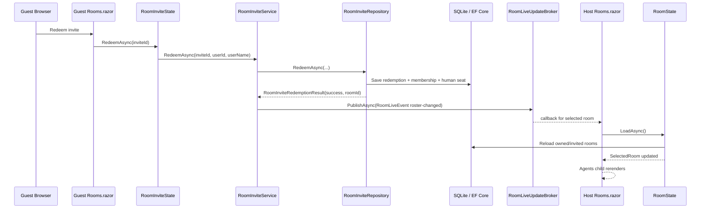

# SignalR Room Roster Pilot Guide

This guide walks through the smallest correct realtime proof for the current web host.

The goal is not to make chat live yet.

The goal is to prove one room-scoped live update end to end:

1. A guest redeems an invite.
2. The server creates the room membership and human participant seat.
3. The room owner sees the new participant appear automatically in the Agents UI without reloading the page.

## Important Note About This Repo

This web app is already a Blazor Server app.

That means it already uses SignalR under the hood through:

- `hybrid/AgentGroupChat.BlazorServer/Program.cs`
- `AddServerSideBlazor()`
- `MapBlazorHub()`

Because Razor component code runs on the server in Blazor Server, the simplest first proof is **not** to create a second `.NET HubConnection` inside `Rooms.razor`.

That would create a server-side client connection back into the same app, which is possible but is the wrong first step here.

The simplest first proof is:

1. keep the existing Blazor Server SignalR circuit
2. add a small server-side room live-update broker
3. let `Rooms.razor` subscribe to room updates through that broker
4. publish a room roster change when an invite is redeemed

This still proves realtime behavior through the current SignalR-backed hosting model, but it avoids a second transport layer before you need one.

If you later want a dedicated custom SignalR hub for external clients or a future SPA, this guide leaves you a clean seam for that. See the appendix at the end.

## What This Pilot Proves

This pilot proves all of the important architecture pieces without touching chat:

- server-side mutation happens once
- another connected user gets notified automatically
- the room page refreshes canonical data from the database
- the agent roster view updates from existing rendering code

It does **not** try to solve:

- transcript sync
- run start or stop
- human turn sync
- AI turn streaming
- reconnect behavior for chat
- room execution locks

Those belong in the next phase.

## Terminology

Use the current domain terms in this guide.

When a guest redeems an invite today, the code in `hybrid/src/AgentGroupChat.Infrastructure/Data/RoomInviteRepository.cs` creates:

1. a `RoomMembership`
2. a **human participant seat** in `Room.Agents`

It does **not** create a new AI agent.

So when this guide says "new roster item" or "new participant appears in Agents", it means a new `AgentConfig` with `IsHumanParticipant = true`.

## Success Criteria

You are done when this exact sequence works:

1. User A opens `Rooms` and selects a room they own.
2. User A opens the Agents tab for that room.
3. User A creates an invite.
4. User B signs in and redeems that invite.
5. The redeem path saves membership plus the new human participant seat.
6. User A sees the new participant appear automatically in the Agents list.
7. Neither user manually reloads the page.

## Current Code Path To Reuse

These are the existing files this pilot should build on.

### Existing UI files

- `hybrid/AgentGroupChat.UI.Shared/Pages/Rooms.razor`
- `hybrid/AgentGroupChat.UI.Shared/Rooms/RoomAgentsEditor.razor`
- `hybrid/AgentGroupChat.UI.Shared/State/RoomInviteState.cs`
- `hybrid/AgentGroupChat.UI.Shared/State/RoomState.cs`

### Existing backend files

- `hybrid/src/AgentGroupChat.Core/Services/Interfaces/IRoomInviteRepository.cs`
- `hybrid/src/AgentGroupChat.Infrastructure/Data/RoomInviteRepository.cs`
- `hybrid/src/AgentGroupChat.Infrastructure/Data/RoomRepository.cs`

### Existing host wiring

- `hybrid/AgentGroupChat.BlazorServer/Program.cs`

## Final Shape After This Pilot



## Recommended File Plan

### New files to add

1. `hybrid/src/AgentGroupChat.Core/Realtime/RoomLiveEventKinds.cs`
2. `hybrid/src/AgentGroupChat.Core/Realtime/RoomLiveEvent.cs`
3. `hybrid/src/AgentGroupChat.Core/Realtime/IRoomLiveUpdateNotifier.cs`
4. `hybrid/src/AgentGroupChat.Core/Services/RoomInviteRedemptionResult.cs`
5. `hybrid/src/AgentGroupChat.Core/Services/RoomInviteService.cs`
6. `hybrid/AgentGroupChat.BlazorServer/Realtime/RoomLiveUpdateBroker.cs`

### Existing files to update

1. `hybrid/src/AgentGroupChat.Core/Services/Interfaces/IRoomInviteRepository.cs`
2. `hybrid/src/AgentGroupChat.Infrastructure/Data/RoomInviteRepository.cs`
3. `hybrid/AgentGroupChat.BlazorServer/Program.cs`
4. `hybrid/AgentGroupChat.UI.Shared/State/RoomInviteState.cs`
5. `hybrid/AgentGroupChat.UI.Shared/Pages/Rooms.razor`

### Files you should leave alone for this pilot

1. `hybrid/AgentGroupChat.UI.Shared/Pages/Chat.razor`
2. `hybrid/src/AgentGroupChat.Core/Services/ConversationRunner.cs`
3. `hybrid/AgentGroupChat.UI.Shared/State/ConversationState.cs`
4. `hybrid/AgentGroupChat.UI.Shared/Rooms/RoomAgentsEditor.razor`

`RoomAgentsEditor.razor` already renders `Room.Agents`. Once `RoomState.LoadAsync()` refreshes the selected room, that child should update naturally.

## Step 1: Add A Shared Realtime Contract In Core

Create a new folder if it does not already exist:

- `hybrid/src/AgentGroupChat.Core/Realtime/`

Keep these types in `Core` so both the UI project and the host project can reference the same event contract.

### Add: `hybrid/src/AgentGroupChat.Core/Realtime/RoomLiveEventKinds.cs`

Purpose:

- central place for room live event names
- keeps string literals out of the UI and broker

Suggested content:

```csharp
namespace AgentGroupChat.Core.Realtime;

public static class RoomLiveEventKinds
{
    public const string RosterChanged = "RosterChanged";
}
```

### Add: `hybrid/src/AgentGroupChat.Core/Realtime/RoomLiveEvent.cs`

Purpose:

- payload that says which room changed and what kind of change occurred
- this is small on purpose
- the UI will reload canonical data instead of trusting event payload details

Suggested content:

```csharp
namespace AgentGroupChat.Core.Realtime;

public sealed record RoomLiveEvent(
    string RoomId,
    string Kind);
```

### Add: `hybrid/src/AgentGroupChat.Core/Realtime/IRoomLiveUpdateNotifier.cs`

Purpose:

- shared abstraction for publish plus subscribe
- lets the invite service publish without knowing how delivery happens
- lets the UI subscribe without knowing whether the backing implementation is in-memory, custom SignalR hub, Redis, or something else later

Suggested content:

```csharp
namespace AgentGroupChat.Core.Realtime;

public interface IRoomLiveUpdateNotifier
{
    IDisposable Subscribe(string roomId, Func<RoomLiveEvent, Task> handler);
    Task PublishAsync(RoomLiveEvent update, CancellationToken cancellationToken = default);
}
```

Why this shape is good for the current app:

- `Subscribe` works naturally for Blazor Server component instances
- `PublishAsync` gives you a single room-scoped push point for the backend
- later, you can keep this same interface and swap the implementation to a custom SignalR hub broadcaster

## Step 2: Add A Richer Redeem Result

Right now `IRoomInviteRepository.RedeemAsync` only returns `bool`.

That is too small for realtime because the caller needs to know **which room changed**.

### Add: `hybrid/src/AgentGroupChat.Core/Services/RoomInviteRedemptionResult.cs`

Purpose:

- carry success plus room id
- optionally carry a readable failure reason for logging or UI diagnostics

Suggested content:

```csharp
namespace AgentGroupChat.Core.Services;

public sealed record RoomInviteRedemptionResult(
    bool Succeeded,
    string? RoomId,
    string? FailureReason)
{
    public static RoomInviteRedemptionResult Success(string roomId) =>
        new(true, roomId, null);

    public static RoomInviteRedemptionResult Failure(string? reason = null, string? roomId = null) =>
        new(false, roomId, reason);
}
```

## Step 3: Add A Small Redeem Orchestration Service

Do not publish live updates from the repository.

Repositories should persist data.
Services should coordinate side effects.

### Add: `hybrid/src/AgentGroupChat.Core/Services/RoomInviteService.cs`

Purpose:

- call the repository redeem path
- if redeem succeeds, publish a room roster changed event

Suggested content:

```csharp
using AgentGroupChat.Core.Realtime;
using AgentGroupChat.Core.Services.Interfaces;

namespace AgentGroupChat.Core.Services;

public sealed class RoomInviteService
{
    private readonly IRoomInviteRepository _inviteRepository;
    private readonly IRoomLiveUpdateNotifier _liveUpdates;

    public RoomInviteService(
        IRoomInviteRepository inviteRepository,
        IRoomLiveUpdateNotifier liveUpdates)
    {
        _inviteRepository = inviteRepository;
        _liveUpdates = liveUpdates;
    }

    public async Task<RoomInviteRedemptionResult> RedeemAsync(
        Guid inviteId,
        string userId,
        string userName,
        CancellationToken cancellationToken = default)
    {
        var result = await _inviteRepository.RedeemAsync(inviteId, userId, userName);
        if (!result.Succeeded || string.IsNullOrWhiteSpace(result.RoomId))
            return result;

        await _liveUpdates.PublishAsync(
            new RoomLiveEvent(result.RoomId, RoomLiveEventKinds.RosterChanged),
            cancellationToken);

        return result;
    }
}
```

This is the most important seam in the whole pilot.

Everything after this can change later, but if you keep the service boundary clean, you can upgrade delivery later without rewriting the room invite flow.

## Step 4: Update The Invite Repository Contract

### Update: `hybrid/src/AgentGroupChat.Core/Services/Interfaces/IRoomInviteRepository.cs`

Change this:

```csharp
Task<bool> RedeemAsync(Guid id, string userId, string username);
```

To this:

```csharp
Task<RoomInviteRedemptionResult> RedeemAsync(Guid id, string userId, string username);
```

Also add the namespace import for the new result type if needed.

### Update: `hybrid/src/AgentGroupChat.Infrastructure/Data/RoomInviteRepository.cs`

Change the implementation so it returns `RoomInviteRedemptionResult`.

Behavior rules:

1. if the invite cannot be found, return failure
2. if the room cannot be found, return failure
3. after the membership and human participant seat are saved, return success with the room id
4. do not publish events here

Suggested behavior outline:

```csharp
public async Task<RoomInviteRedemptionResult> RedeemAsync(Guid id, string userId, string username)
{
    var inviteEntity = ...;
    if (inviteEntity is null)
        return RoomInviteRedemptionResult.Failure("Invite not found or already redeemed.");

    try
    {
        // existing redeem logic

        if (currRoom is null)
            return RoomInviteRedemptionResult.Failure("Room not found.");

        // existing membership creation
        // existing human participant seat creation

        await _db.SaveChangesAsync();
        return RoomInviteRedemptionResult.Success(updatedInviteEntity.RoomId);
    }
    catch (Exception ex)
    {
        return RoomInviteRedemptionResult.Failure(ex.Message);
    }
}
```

Do not change the actual membership or seat creation rules in this pilot.

Keep the current behavior that a redeemed invite creates exactly one human participant seat if one does not already exist.

## Step 5: Add The Blazor Server Room Live Update Broker

Create a new folder:

- `hybrid/AgentGroupChat.BlazorServer/Realtime/`

This broker is the concrete implementation for the current host.

It is intentionally simple:

- singleton service
- room id to callback list
- publish invokes all current handlers for that room
- each component unsubscribes when disposed

### Add: `hybrid/AgentGroupChat.BlazorServer/Realtime/RoomLiveUpdateBroker.cs`

Purpose:

- bridge backend room events to connected Blazor Server circuits
- no second custom hub yet
- no extra JS yet
- tiny enough to understand in one file

Suggested content:

```csharp
using AgentGroupChat.Core.Realtime;
using System.Collections.Concurrent;

namespace AgentGroupChat.BlazorServer.Realtime;

public sealed class RoomLiveUpdateBroker : IRoomLiveUpdateNotifier
{
    private readonly ConcurrentDictionary<string, ConcurrentDictionary<Guid, Func<RoomLiveEvent, Task>>> _subscriptions = new(StringComparer.Ordinal);

    public IDisposable Subscribe(string roomId, Func<RoomLiveEvent, Task> handler)
    {
        var subscriptionId = Guid.NewGuid();
        var roomSubscriptions = _subscriptions.GetOrAdd(
            roomId,
            static _ => new ConcurrentDictionary<Guid, Func<RoomLiveEvent, Task>>());

        roomSubscriptions[subscriptionId] = handler;

        return new Subscription(() => Unsubscribe(roomId, subscriptionId));
    }

    public async Task PublishAsync(RoomLiveEvent update, CancellationToken cancellationToken = default)
    {
        if (!_subscriptions.TryGetValue(update.RoomId, out var roomSubscriptions))
            return;

        foreach (var handler in roomSubscriptions.Values)
        {
            cancellationToken.ThrowIfCancellationRequested();

            try
            {
                await handler(update);
            }
            catch
            {
                // Keep the broker resilient for the first pilot.
                // You can add logging later if a subscriber throws.
            }
        }
    }

    private void Unsubscribe(string roomId, Guid subscriptionId)
    {
        if (!_subscriptions.TryGetValue(roomId, out var roomSubscriptions))
            return;

        roomSubscriptions.TryRemove(subscriptionId, out _);

        if (roomSubscriptions.IsEmpty)
            _subscriptions.TryRemove(roomId, out _);
    }

    private sealed class Subscription : IDisposable
    {
        private readonly Action _dispose;
        private int _disposed;

        public Subscription(Action dispose) => _dispose = dispose;

        public void Dispose()
        {
            if (Interlocked.Exchange(ref _disposed, 1) == 1)
                return;

            _dispose();
        }
    }
}
```

Why singleton:

- all connected Blazor Server circuits in this process need to subscribe to the same broker
- scoped would isolate subscriptions per circuit and defeat the purpose

## Step 6: Register The New Services In The Host

### Update: `hybrid/AgentGroupChat.BlazorServer/Program.cs`

Add the new using statements you need.

Register these services:

```csharp
builder.Services.AddSingleton<IRoomLiveUpdateNotifier, RoomLiveUpdateBroker>();
builder.Services.AddScoped<RoomInviteService>();
```

Place them near your other core or state service registrations.

Important:

- do not remove `AddServerSideBlazor()`
- do not remove `MapBlazorHub()`
- do not add a second custom hub in this pilot

That is intentional.

## Step 7: Update `RoomInviteState` To Use The New Service

### Update: `hybrid/AgentGroupChat.UI.Shared/State/RoomInviteState.cs`

Purpose:

- keep state class responsible for UI-facing invite actions
- use `RoomInviteService` only for the redeem path
- keep create, list, and revoke on the repository for now

Constructor change:

Add `RoomInviteService` as a dependency.

Suggested private field:

```csharp
private readonly RoomInviteService _roomInviteService;
```

Suggested constructor shape:

```csharp
public RoomInviteState(
    IRoomInviteRepository inviteRepo,
    IUserContext userContext,
    RoomInviteService roomInviteService)
{
    _inviteRepo = inviteRepo;
    _userContext = userContext;
    _roomInviteService = roomInviteService;
}
```

Change the redeem method from:

```csharp
public async Task<bool> RedeemAsync(Guid id)
```

To:

```csharp
public async Task<RoomInviteRedemptionResult> RedeemAsync(Guid id)
```

Suggested implementation:

```csharp
public async Task<RoomInviteRedemptionResult> RedeemAsync(Guid id)
{
    var userId = await _userContext.GetRequiredUserIdAsync();

    return await _roomInviteService.RedeemAsync(
        id,
        userId,
        _userContext.UserName ?? "New Player");
}
```

Do not have `RoomInviteState` publish anything directly.

The service layer should remain the publish point.

## Step 8: Subscribe The Rooms Page To Live Room Updates

This is the client-side piece for the current host model.

Because this is Blazor Server, `Rooms.razor` can subscribe directly to the singleton broker and receive callbacks on its server-side component instance.

### Update: `hybrid/AgentGroupChat.UI.Shared/Pages/Rooms.razor`

#### 1. Inject the live update notifier

Add:

```razor
@inject AgentGroupChat.Core.Realtime.IRoomLiveUpdateNotifier RoomLiveUpdates
```

Or add the `@using AgentGroupChat.Core.Realtime` namespace and inject the shorter type name.

#### 2. Switch the page to `IAsyncDisposable` only if you need it later

For this pilot, plain `IDisposable` is enough because the broker subscription is synchronous.

You can keep:

```razor
@implements IDisposable
```

#### 3. Add a field to hold the current room subscription

Suggested field:

```csharp
private IDisposable? _roomLiveSubscription;
```

#### 4. Add a helper to resubscribe when the selected room changes

Suggested helper:

```csharp
private void SubscribeToRoomLiveUpdates(string? roomId)
{
    _roomLiveSubscription?.Dispose();
    _roomLiveSubscription = null;

    if (string.IsNullOrWhiteSpace(roomId))
        return;

    _roomLiveSubscription = RoomLiveUpdates.Subscribe(roomId, HandleRoomLiveUpdateAsync);
}
```

#### 5. Add the callback that reloads room state

Suggested callback:

```csharp
private Task HandleRoomLiveUpdateAsync(RoomLiveEvent update)
{
    return InvokeAsync(async () =>
    {
        if (!string.Equals(update.Kind, RoomLiveEventKinds.RosterChanged, StringComparison.Ordinal))
            return;

        var selectedRoomId = RoomState.SelectedRoom?.Id;

        await RoomState.LoadAsync();

        if (!string.IsNullOrWhiteSpace(selectedRoomId))
        {
            var selectedRoom = RoomState.Rooms.FirstOrDefault(r => r.Id == selectedRoomId);
            if (selectedRoom is not null)
            {
                _selectedRoomId = selectedRoom.Id;
                RoomState.SelectRoom(selectedRoom);
            }
        }

        StateHasChanged();
    });
}
```

Why reload instead of patching the room locally:

- the repository already defines the canonical data shape
- you avoid duplicating roster mutation logic in the page
- this stays correct when more room details are added later

#### 6. Subscribe after selecting a room

Update `SelectRoomAsync(RoomConfig room)` so that after `RoomState.SelectRoom(room)` it also calls:

```csharp
SubscribeToRoomLiveUpdates(room.Id);
```

#### 7. Subscribe during initialization if a room is already selected

In `OnInitializedAsync()`:

- after `RoomState.LoadAsync()`
- after deciding which room is selected
- call `SubscribeToRoomLiveUpdates(RoomState.SelectedRoom?.Id)`

If the page auto-selects the first room, subscribe to that room too.

#### 8. Refresh local state after successful redeem

Update the local redeem handler in `Rooms.razor`.

The current method expects `bool`. Change it to use `RoomInviteRedemptionResult`.

Suggested shape:

```csharp
private async Task RedeemInvite()
{
    try
    {
        var result = await RoomInviteState.RedeemAsync(new Guid(redeemCode));
        if (result.Succeeded)
        {
            await RoomState.LoadAsync();

            var redeemedRoom = RoomState.Rooms.FirstOrDefault(r => r.Id == result.RoomId);
            if (redeemedRoom is not null)
            {
                _selectedRoomId = redeemedRoom.Id;
                RoomState.SelectRoom(redeemedRoom);
                SubscribeToRoomLiveUpdates(redeemedRoom.Id);
            }

            Snackbar.Add("Invite redeemed!", Severity.Success);
            redeemCode = string.Empty;
        }
        else
        {
            Snackbar.Add(
                string.IsNullOrWhiteSpace(result.FailureReason)
                    ? "Failed to redeem invite. Please check the code and try again."
                    : result.FailureReason,
                Severity.Error);
        }
    }
    catch
    {
        Snackbar.Add("Failed to redeem invite. Please check the code and try again.", Severity.Error);
    }
}
```

The guest page should update itself locally after redeem.

Do not depend on the live update broker for the redeemer's own UI refresh.

#### 9. Dispose the room subscription correctly

The page already has a small unsubscribe bug today.

It subscribes with:

```csharp
RoomState.OnChange += UpdateSelectedRoom;
```

But currently disposes with:

```csharp
RoomState.OnChange -= StateHasChanged;
```

While you are editing this file, fix that.

Your dispose should do both:

```csharp
public void Dispose()
{
    RoomState.OnChange -= UpdateSelectedRoom;
    _roomLiveSubscription?.Dispose();
}
```

If the file also wires any other event handlers, unsubscribe those too as usual.

## Step 9: Leave `RoomAgentsEditor.razor` Alone

Do not add realtime logic to `hybrid/AgentGroupChat.UI.Shared/Rooms/RoomAgentsEditor.razor` for this pilot.

That file already does the right thing for rendering.

Once the parent `Rooms.razor` reloads `RoomState.SelectedRoom`, the child should naturally receive the updated `Room` parameter and show the new human participant seat.

Keeping all realtime wiring in the parent page gives you:

- fewer moving parts
- one place to own the selected room subscription
- a cleaner later path to transcript or chat events

## Step 10: Build And Validate

### Build check

From `hybrid/` run:

```powershell
dotnet build AgentGroupChat.slnx
```

### Manual validation checklist

1. Sign in as room owner in browser window A.
2. Open `Rooms`.
3. Select an owned room.
4. Open the Agents tab.
5. Create an invite.
6. Sign in as a different user in browser window B.
7. Paste the invite code into the redeem input on `Rooms`.
8. Submit redeem.
9. Confirm window B sees the room locally.
10. Confirm window A sees the new participant appear automatically in the Agents list.

### If it does not update automatically

Check these in order:

1. `RoomInviteRepository.RedeemAsync()` is returning success with the correct room id.
2. `RoomInviteService.RedeemAsync()` is publishing `RosterChanged` after save.
3. `RoomLiveUpdateBroker.PublishAsync()` is being called.
4. `Rooms.razor` has an active subscription for the selected room id.
5. `HandleRoomLiveUpdateAsync()` is actually reloading `RoomState`.
6. `RoomState.LoadAsync()` is preserving the selected room by id.
7. The new human participant seat is actually present in the DB-backed room returned by `RoomRepository`.

## Common Mistakes To Avoid

### Mistake 1: publishing directly from the repository

Do not inject the broker into `RoomInviteRepository`.

Keep persistence and notification separate.

### Mistake 2: patching `Room.Agents` manually in the page callback

Reload from `RoomState.LoadAsync()`.

The database is the source of truth.

### Mistake 3: adding chat or transcript sync in the same pass

Do not widen scope.

This pilot is only proving room roster realtime.

### Mistake 4: assuming invite redeem creates an AI agent

It creates a human participant seat.

That is the correct current domain behavior.

### Mistake 5: forgetting to unsubscribe

Blazor Server component instances can live longer than you expect.

Dispose your room live subscription and the existing `RoomState.OnChange` subscription correctly.

## Why This Pilot Is Better Than Starting With Chat

This pilot only needs one server-side mutation and one UI refresh.

Chat would immediately force you to answer much harder questions:

- who owns the active run
- who is allowed to continue a run
- how duplicate transcript appends are prevented
- how agent status events are ordered
- how reconnect works mid-run
- where room locking lives

This roster pilot proves the live update seam first, without paying the runtime complexity cost.

## What To Build Next After This Works

Once this pilot works, the next sensible step is transcript refresh.

Do it with the same pattern:

1. create a new event kind such as `TranscriptChanged`
2. publish that event after transcript append
3. let the chat page reload canonical transcript data on event

Do not stream individual AI tokens yet.

Keep the next step to room-scoped append plus refresh.

## Appendix: How This Evolves Into A Dedicated Custom SignalR Hub Later

If you later decide to support:

- a separate browser client
- a SPA
- a non-Blazor client
- explicit browser-level presence or reconnect logic

Then keep all of the **Core** changes from this guide and replace only the host delivery mechanism.

### Keep these files

1. `hybrid/src/AgentGroupChat.Core/Realtime/RoomLiveEventKinds.cs`
2. `hybrid/src/AgentGroupChat.Core/Realtime/RoomLiveEvent.cs`
3. `hybrid/src/AgentGroupChat.Core/Realtime/IRoomLiveUpdateNotifier.cs`
4. `hybrid/src/AgentGroupChat.Core/Services/RoomInviteService.cs`
5. `hybrid/src/AgentGroupChat.Core/Services/RoomInviteRedemptionResult.cs`

### Replace this file

1. `hybrid/AgentGroupChat.BlazorServer/Realtime/RoomLiveUpdateBroker.cs`

With:

1. a custom `RoomEventsHub`
2. a SignalR-based notifier implementation using `IHubContext<RoomEventsHub>`
3. a browser-side subscriber using JavaScript SignalR or a future client app

That is exactly why this guide creates the live update abstraction first.

The domain and service shape stay stable while the transport evolves.