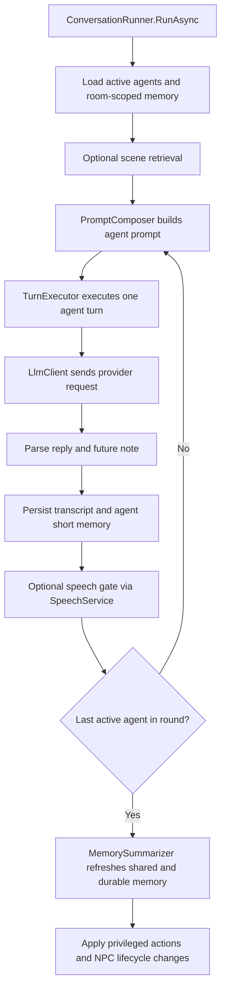

# AgentGroupChat.Core Overview

This document is the newcomer map for `AgentGroupChat.Core`.

If you want to understand how the app actually runs a room, this is the project to read first. `Core` owns the conversation loop, prompt construction, model calls, memory refresh, scene retrieval, speech orchestration surface, and the domain models shared by the other projects.

It does **not** own the UI and it does **not** own database persistence details. Those live in `AgentGroupChat.Hybrid` and `AgentGroupChat.Infrastructure`.

---

## What This Project Owns

- the room execution loop
- individual agent turn execution
- prompt assembly and context shaping
- model transport abstraction for AI calls
- speech service abstraction used by the UI
- memory summarization and scene retrieval
- domain models such as rooms, agents, transcript turns, memory blocks, scene archives, settings, and AI catalog records
- repository interfaces consumed by the UI and implemented by Infrastructure

---

## Read This First

For a new developer, the best reading order is:

1. `Services/ConversationRunner.cs`
2. `Services/TurnExecutor.cs`
3. `Services/PromptComposer.cs`
4. `Services/MemorySummarizer.cs`
5. `Services/SceneRetrievalService.cs`
6. `Services/LlmClient.cs`
7. `Models/Domain/RoomConfig.cs`
8. `Models/Domain/AgentConfig.cs`
9. `Models/Llm/LlmTypes.cs`
10. `Services/Interfaces/*.cs`

If you only read one file to understand the product logic, read `ConversationRunner.cs`.

---

## The Core Execution Flow

At a high level, the room runtime works like this:

The important design choice is that **turn orchestration lives in one place**. Everything else in `Core` supports that loop.

---

## High-Priority Files

### `Services/ConversationRunner.cs`

This is the center of the runtime.

What it does:

- iterates through rounds and active agents
- loads room memory for each turn
- asks `PromptComposer` for a prompt
- asks `TurnExecutor` to run the turn
- appends transcript turns
- updates agent short memory from `<future_note>`
- optionally gates progression on speech playback
- triggers `MemorySummarizer` after round completion
- retrieves archived scenes when enabled
- applies privileged agent actions such as NPC spawn/dismiss or temporary suspension/resume

Why it matters:

- this is where the product's real behavior is decided
- this is the file to inspect first when turn order, memory flow, or DM actions behave unexpectedly

### `Services/TurnExecutor.cs`

This file owns one agent turn at a time.

What it does:

- builds the final message list sent to the model
- enforces the two-block XML transport shape
- parses `<reply>` and `<future_note>` from model output
- salvages partially malformed output when possible
- returns the visible reply plus hidden scratchpad content

Why it matters:

- this is the real boundary between prompt design and model response parsing
- if output formatting breaks, start here

### `Services/PromptComposer.cs`

This file decides what context the model sees.

What it does:

- builds agent prompts from room settings, transcript window, shared memory, durable memory, private memory, and recalled scenes
- shapes context differently for early vs. late agents in a round
- builds memory summarizer prompts
- builds durable memory prompts
- sanitizes structured memory blocks
- emits the privileged-actions instruction block when enabled

Why it matters:

- this is the best file for understanding prompt budget and context policy
- changes here can affect output quality more than almost anywhere else

### `Services/MemorySummarizer.cs`

This file rolls the hidden memory forward after rounds.

What it does:

- refreshes `SharedRoom` memory after each round
- promotes `Durable` memory on the configured cadence
- preserves previous memory when summarizer output is truncated or invalid
- archives scene snapshots when scene archive is enabled

Why it matters:

- this is where continuity is protected or lost
- if the room forgets things or bloats memory, inspect this file next

### `Services/SceneRetrievalService.cs`

This file adds retrieval-augmented scene recall.

What it does:

- selects archived scenes relevant to the current round
- uses the model over scene metadata rather than embeddings
- returns a small recalled-context slice that `PromptComposer` can inject

Why it matters:

- this is the current long-horizon continuity seam
- it is isolated enough to evolve independently later

### `Services/LlmClient.cs`

This file is the transport abstraction for backend agent calls.

What it does:

- sends chat-completion-style requests to configured providers
- supports OpenAI-compatible, Groq, Gemini, HuggingFace, and Ollama
- normalizes completion results and usage summaries

Why it matters:

- if a model call fails, this is the transport-level file to inspect
- this is the current backend-agent-call surface for the app

### `Services/SpeechService.cs`

This file handles text-to-speech execution.

What it does:

- supports Local Windows voices, Piper, and Kokoro
- normalizes playback behavior across providers
- exposes speech gating used by `ConversationRunner`
- handles Kokoro preview, Piper process streaming, and local voice playback

Why it matters:

- this is not the core room loop, but it does affect pacing and user-visible execution flow

### `Services/LogService.cs`

This is a small but important wrapper over log persistence.

What it does:

- writes structured log entries
- exposes an event that the UI can subscribe to

Why it matters:

- it is the bridge between the runtime and the Logs page

---

## Domain Model Files

These files define the main nouns the runtime works with.

### `Models/Domain/RoomConfig.cs`

Owns room-level configuration:

- topic and pacing
- summarizer model and summarization settings
- scene archive settings
- privileged action settings
- NPC defaults
- scene image defaults
- the `Agents` collection

Read this early because it tells you what the runtime can vary per room.

### `Models/Domain/AgentConfig.cs`

Owns agent-level configuration:

- name, model, prompt, enablement
- token override and compaction budget
- UI colors
- TTS voice override
- appearance summary
- NPC and suspension metadata

This file is the main participant model.

### `Models/Domain/TranscriptTurn.cs`

Represents persisted transcript records.

### `Models/Domain/MemoryBlock.cs`

Represents a structured memory block keyed by room, optional agent, and kind.

### `Models/Domain/SceneArchive.cs`

Represents an archived scene snapshot used for retrieval.

### `Models/Domain/AiConnection.cs` and `Models/Domain/AiModel.cs`

Represent the text-model catalog chosen in the UI.

### `Models/Domain/AppSettings.cs`

Represents cross-app settings such as theme, TTS configuration, and setup flags.

### `Models/Domain/LogEntry.cs`

Represents persisted logs queried by the Logs page.

---

## LLM Types

### `Models/Llm/LlmTypes.cs`

This file defines the common transport types used across providers.

It is the place to look for:

- provider enum values
- request settings structure
- chat message type
- completion result type

---

## Repository Interfaces

The interfaces under `Services/Interfaces` are the persistence seams that Infrastructure implements:

- `IRoomRepository.cs`
- `ITranscriptRepository.cs`
- `IMemoryRepository.cs`
- `ISceneArchiveRepository.cs`
- `ISettingsRepository.cs`
- `ILogRepository.cs`
- `ILegacyDataSource.cs`

These files are individually simple, but they matter architecturally because they keep `Core` storage-agnostic.

Read them after the runtime files, not before.

---

## Project Structure Summary

### Highest priority

- `Services/ConversationRunner.cs`
- `Services/TurnExecutor.cs`
- `Services/PromptComposer.cs`
- `Services/MemorySummarizer.cs`
- `Services/SceneRetrievalService.cs`
- `Services/LlmClient.cs`

### Second priority

- `Services/SpeechService.cs`
- `Models/Domain/RoomConfig.cs`
- `Models/Domain/AgentConfig.cs`
- `Models/Llm/LlmTypes.cs`

### Supporting but important

- `Models/Domain/TranscriptTurn.cs`
- `Models/Domain/MemoryBlock.cs`
- `Models/Domain/SceneArchive.cs`
- `Models/Domain/AiConnection.cs`
- `Models/Domain/AiModel.cs`
- `Models/Domain/AppSettings.cs`
- `Models/Domain/LogEntry.cs`
- `Services/LogService.cs`
- `Services/Interfaces/*.cs`

### Lowest priority for first orientation

- `AgentGroupChat.Core.csproj`

The project file is straightforward and only matters once you are changing dependencies or target framework behavior.

---

## Current Design Choices

These are the important design choices visible in `Core` today:

- one centralized room runner controls the execution loop
- prompt transport is rigid and XML-shaped on purpose
- memory is layered, not monolithic
- scene retrieval is model-guided, not embedding-based
- speech can gate perceived turn completion, but the runtime still owns sequencing
- storage is abstracted behind interfaces so the UI and Infrastructure can evolve independently

---

## What To Ignore At First

If you are onboarding, do not start with:

- the repository interfaces in detail
- individual domain-model property lists
- minor utility logic inside `SpeechService`

Start with the runtime path, then come back for the details.

---

## Best First Tasks For A New Developer

If you want a safe starting point:

1. Trace one complete room run from `ConversationRunner.RunAsync()` through `TurnExecutor` and back.
2. Trace how `PromptComposer` builds one agent prompt.
3. Trace how `MemorySummarizer` updates shared and durable memory after the round.
4. Trace one provider call through `LlmClient`.

That path will explain most of the system faster than reading every file top to bottom.