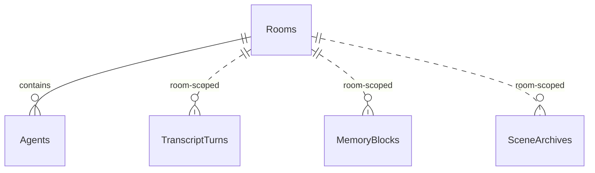

# AgentGroupChat.Infrastructure Overview

This document is the newcomer map for `AgentGroupChat.Infrastructure`.

If `Core` defines the room logic and `Hybrid` defines the desktop app, `Infrastructure` defines how the app persists data. This project owns the EF Core `DbContext`, SQLite schema, entity mapping, repository implementations, and the additive migration path from older local storage.

It does **not** own runtime behavior and it does **not** own the UI. It gives those layers a database-backed implementation.

---

## What This Project Owns

- EF Core setup and `DbContext`
- entity classes for the SQLite schema
- domain-to-entity mapping
- repository implementations for settings, rooms, transcript, memory, logs, and scene archives
- additive schema evolution logic
- legacy JSON/TXT migration into the new database

---

## Read This First

For a new developer, the best reading order is:

1. `Data/AppDbContext.cs`
2. `Entities/Entities.cs`
3. `Data/EntityMapper.cs`
4. `Data/RoomRepository.cs`
5. `Data/SettingsRepository.cs`
6. `Data/MemoryRepository.cs`
7. `Data/TranscriptRepository.cs`
8. `Data/SceneArchiveRepository.cs`
9. `Data/LogRepository.cs`
10. `Migration/DataMigrator.cs`
11. `Migration/LegacyJsonDataSource.cs`

If you only read one file to understand the database structure, read `AppDbContext.cs` first and then `Entities.cs` immediately after it.

---

## Best File For The Database Overview

The single best schema overview file is:

- `Data/AppDbContext.cs`

Why:

- it shows every `DbSet`
- it shows the only explicit foreign key relationship in the current model
- it shows the important indexes

`Entities/Entities.cs` is the second file to read because it shows the actual columns and defaults.

---

## Current Database Shape

The current database stores nine main tables:

- `AppSettings`
- `AiConnections`
- `AiModels`
- `Rooms`
- `Agents`
- `TranscriptTurns`
- `MemoryBlocks`
- `LogEntries`
- `SceneArchives`

### Relationship Summary

The current model has one explicit entity relationship and several room-scoped logical relationships.

Important nuance:

- `Rooms -> Agents` is a real EF relationship with cascade delete.
- transcript turns, memory blocks, and scene archives are logically tied to rooms by `RoomId`, but they are not modeled with EF navigation properties or foreign keys here.

### Indexes And Constraints

Current important indexes and constraints:

- `TranscriptTurns.RoomId`
- unique `MemoryBlocks(RoomId, AgentId, Kind)`
- `LogEntries.Category`
- `LogEntries.Source`
- `SceneArchives.RoomId`
- `SceneArchives(RoomId, RoundNumber)`

The most important constraint is that each memory slot is unique by room, optional agent, and memory kind.

---

## Schema Tables In Plain Language

### `AppSettings`

One-row app-level settings table.

Stores:

- theme and accent
- TTS provider and rate
- Piper and Kokoro configuration
- setup-guide completion flags

This is singleton-style configuration, not a catalog.

### `AiConnections`

Global list of text-model provider endpoints.

Stores:

- logical connection name
- transport type
- endpoint
- API key
- sort order

### `AiModels`

Global model catalog used by rooms and summarizers.

Stores:

- display name
- connection id
- provider model id
- notes
- sort order

### `Rooms`

The room root aggregate.

Stores:

- name and topic
- pacing and transcript-window settings
- summarizer selection and compression settings
- scene image defaults
- scene archive settings
- privileged action and NPC defaults

### `Agents`

Child records of a room.

Stores:

- system prompt and model selection
- enablement and token overrides
- UI color choices
- TTS voice override
- appearance summary
- NPC metadata
- suspension metadata

### `TranscriptTurns`

Append-only room transcript history.

Stores:

- room id
- round number
- speaker
- content
- colors used in chat UI
- timestamp

### `MemoryBlocks`

Structured hidden memory storage.

Stores one block per unique `(RoomId, AgentId, Kind)` combination.

Kinds are defined in `Core` and include shared room memory, durable memory, and agent-private short and long memory.

### `LogEntries`

Structured logs used by the Logs page.

Stores:

- category
- source
- summary message
- optional detail payload
- optional duration
- timestamp

### `SceneArchives`

Archived scene snapshots used by retrieval.

Stores:

- room id
- round number
- short label
- key entities summary
- shared room snapshot
- durable snapshot
- major/minor marker
- timestamp

---

## High-Priority Files

### `Data/AppDbContext.cs`

This file defines the EF model root.

What it does:

- exposes every `DbSet`
- defines the `Room -> Agents` relationship with cascade delete
- defines indexes for transcript turns, memory blocks, logs, and scene archives

Why it matters:

- it is the fastest schema overview in the whole project

### `Entities/Entities.cs`

This file defines all current entity classes and their defaults.

Why it matters:

- if you want to know what actually lives in the database today, this is the file
- it is also the first place to change when adding new persisted data

### `Data/EntityMapper.cs`

This file maps database entities to the domain types in `Core` and back.

Why it matters:

- it is the boundary that keeps persistence details out of the runtime and UI
- most persistence bugs show up here or in a repository

---

## Repository Files

The `Data` folder contains the runtime-facing persistence implementations.

### `Data/RoomRepository.cs`

This is the most important repository after settings.

What it does:

- loads rooms with their agents eagerly
- saves the room root record
- diff-merges the incoming agent list
- removes deleted agents
- updates existing agents in place

Why it matters:

- this is the write path for almost all room configuration
- it preserves the room-plus-agents aggregate model

### `Data/SettingsRepository.cs`

This handles app settings and the AI catalog.

What it does:

- upserts the singleton `AppSettings`
- upserts AI connections
- upserts AI models

Why it matters:

- it is the backing store behind `AppState`

### `Data/MemoryRepository.cs`

This handles hidden memory persistence.

What it does:

- fetches memory by room, optional agent, and kind
- saves or updates one block per unique slot
- clears all memory for a room

Why it matters:

- the unique memory-slot pattern is an important current design choice

### `Data/TranscriptRepository.cs`

This handles transcript append and retrieval.

What it does:

- loads transcript turns by room
- appends new turns
- clears a room transcript

### `Data/SceneArchiveRepository.cs`

This handles retrieval-oriented archives.

What it does:

- loads archives by room or id set
- appends new archives
- prunes older entries when above retention cap

Important detail:

- pruning prefers removing older minor snapshots before older major ones

### `Data/LogRepository.cs`

This handles structured logs.

What it does:

- appends logs
- queries by category and source
- clears logs
- returns known log sources

---

## Migration Files

### `Migration/DataMigrator.cs`

This file is critical because the project does not currently rely on a standard EF migrations folder.

What it does:

- ensures the database exists
- evolves schema additively with manual `ALTER TABLE` logic
- creates new tables and indexes if missing
- imports legacy data if present and the new database is still empty

Important current design choice:

- schema evolution is manual and additive
- column existence is checked before alteration
- the goal is to keep local installs forward-compatible without destructive migration steps

This file is also the best place to inspect recent schema growth such as:

- scene image fields
- scene archive table creation
- privileged/NPC fields
- Kokoro user voice field

### `Migration/LegacyJsonDataSource.cs`

This file reads the old WPF-era local files and turns them into domain models for import.

Why it matters:

- it explains the migration path from the earlier app format into SQLite
- it is important when debugging upgrade scenarios, but not the best first file for general onboarding

---

## Project Structure Summary

### Highest priority

- `Data/AppDbContext.cs`
- `Entities/Entities.cs`
- `Data/EntityMapper.cs`
- `Data/RoomRepository.cs`
- `Data/SettingsRepository.cs`
- `Migration/DataMigrator.cs`

### Second priority

- `Data/MemoryRepository.cs`
- `Data/TranscriptRepository.cs`
- `Data/SceneArchiveRepository.cs`
- `Data/LogRepository.cs`
- `Migration/LegacyJsonDataSource.cs`

### Lowest priority for first orientation

- `AgentGroupChat.Infrastructure.csproj`

The project file is simple and only matters when changing package references or target framework behavior.

---

## Current Design Choices

These are the main persistence design choices visible today:

- SQLite is the current local backing store
- rooms and agents are treated as one aggregate for save behavior
- many room-scoped records use `RoomId` without full relational navigation modeling
- schema changes are additive and manually managed
- repository implementations stay thin and mostly translate domain objects to EF operations

These choices make the app easy to iterate on locally, even if a future online architecture may eventually want a stricter schema and migration model.

---

## What To Ignore At First

If you are onboarding, do not start by reading every repository line by line.

Instead:

1. read `AppDbContext.cs`
2. read `Entities.cs`
3. read `RoomRepository.cs`
4. read `SettingsRepository.cs`
5. then read `DataMigrator.cs`

That sequence explains most of the persistence model without drowning you in CRUD details.

---

## Best First Tasks For A New Developer

If you want a safe onboarding path:

1. Trace how a room and its agents are saved through `RoomRepository`.
2. Trace how app settings and model catalog entries are loaded through `SettingsRepository`.
3. Trace how one memory block is persisted and reloaded.
4. Read `DataMigrator.cs` to understand how schema changes should be added.

That path explains the database and persistence model faster than reading files alphabetically.